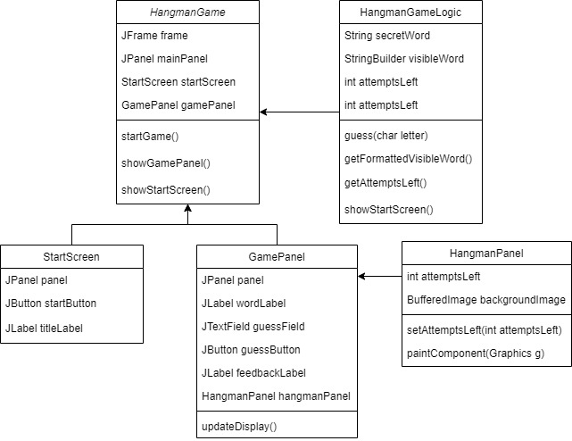

# JavaHangmanGUI

## Project Members

- Hyeonuk Kim (22000204)


## Project Description

This Hangman game is a simple Java-based game with a graphical user interface built using Swing. The game features a start screen and a game screen, both with a full-frame background image. The game logic includes guessing letters of a hidden word, and the game tracks the number of remaining attempts. When the player runs out of attempts or guesses the word correctly, the game provides appropriate feedback.

## UML Diagram of Classes and Interfaces


## How to Use the Program

1. **Clone the Repository**

   First, clone the repository to your local machine using the following command:

   ```bash
   git clone https://github.com/gusdnr2/JavaHangmanGUI
   cd JavaHangmanGUI

2. **Compile the Java Source Files**
   ```java
   javac -d bin src/*.java

3. **Run the Game**
   ```java
   java -cp bin HangmanGame

## User's Guide

1. **Start the Game**
   - When you launch the application, the start screen will appear with a welcoming message and a "Start Game" button.
   - Click the "Start Game" button to begin the game.

2. **Guess the Word**
   - Once the game starts, you will see underscores representing the letters of the hidden word.
   - Type a letter into the input field and click the "Guess" button to make a guess.

3. **Check Your Progress**
   - If your guessed letter is in the word, it will replace the corresponding underscore(s).
   - If the guessed letter is not in the word, the number of attempts left will decrease and the hangman figure will start to appear.

4. **Win or Lose**
   - You win the game if you correctly guess all the letters in the word before running out of attempts.
   - You lose the game if you run out of attempts before guessing the word.

5. **Feedback and Restart**
   - After winning or losing, the game will provide feedback and prompt you with the correct word if you lost.
   - To play again, you will need to restart the application.

### Controls

- **Start Button:** Initiates the game.
- **Input Field:** Enter your guessed letter here.
- **Guess Button:** Submits your guess.

### Notes

- Only single letters can be guessed at a time.
- The game is case-insensitive; 'A' is treated the same as 'a'.
- You have a limited number of attempts, so guess wisely!
